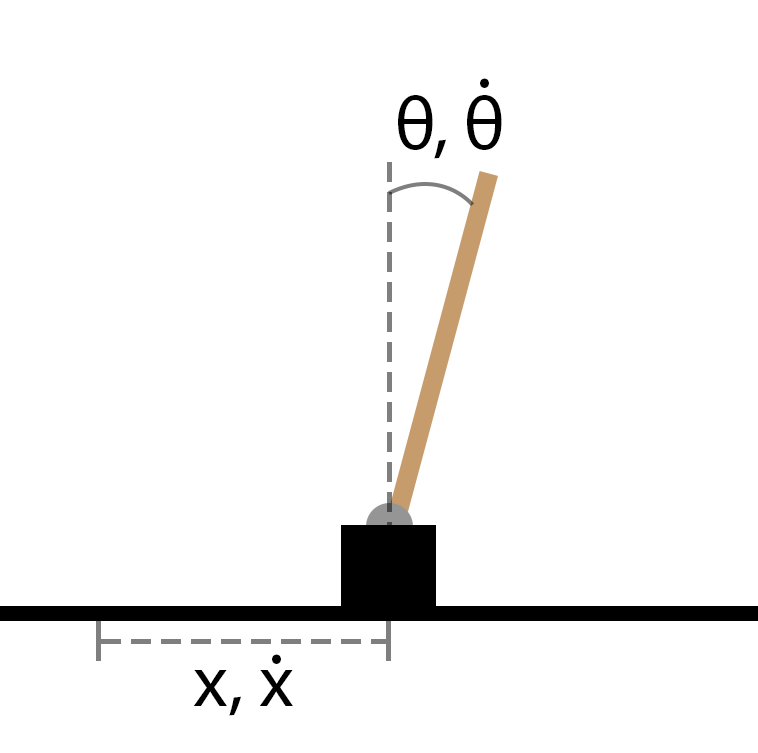

This is the project repository for a collection of reinforcement learning algorithm implementations for the balancing cart pole control problem.
The algorithms implemented include:
- Q-learning (off-policy temporal difference)
- Actor-critic policy gradient
- Temporal difference (with value function approximation, both linear and neural network versions)

## Overview

The objective of this project was to replicate the reinforcement learning (RL) algorithms implemented in the paper "Comparison of Reinforcement Learning Algorithms applied to the Cart-Pole Problem" by Nagendra et al., published in IEEE from the 2017 International Conference on Advances in Computing, Communications and Informatics (ICACCI) [1](https://arxiv.org/abs/1810.01940).

The cart pole balancing task is a variant of the classical inverted pendulum nonlinear control problem. The cart is modelled as a rigid body able to move along a one-directional line, with one end of a rigid pole fixed to the centre of the cart at a pivot point (Figure 1). The objective of the controller is to move the cart back and forth along a single dimension to balance the pole at the unstable equilibrium θ = 0, where θ is the angle off the vertical axis, positive clockwise.





The system dynamics were modelled with the differential equations (Equations 1 and 2), as detailed in the paper [1]. The system parameter values, which were kept constant across all simulations, are listed in Table 1.


The objective of an agent is to keep the pole angle within 12° from the vertical and the cart position within a 4.8m long track. The environment is deterministic, so taking action a from state s results in a transition to state s' with a probability of 1. Additionally, the initial state is randomized to be between the defined state boundaries.
For evaluations using discrete state spaces, the state space was discretized into two different granularities shown in Table 2. Both discretizations are identical apart from the increased number of bins for the pole angle θ.


For each of the algorithms, learning was halted when the policy resulted in the agent keeping the pole upright and balanced for the entirety of the simulation interval, which was set to 200s. Lastly, the tkinter graphics library was used to create the animations of the resulting policies.

## Q-learning off-policy TD

The implementation pseudocode is as follows:
```
for e in episode:
    Initialize simulation
    Get initial states S
    for each step in episode:
        Get initial action A using epsilon-greedy mechanism
        Obtain next state S', reward R
        Use Q-table to determine the best action
        Update the Q table
        S ← S'
```
## Actor-critic policy gradient
The implementation pseudocode is as follows:
```
Create an initialize actor and critic networks with random weights
for e in episode:
    Initialize simulation
    Get initial states S
    for each step in episode:
        Sample action A from actor network
        Obtain next state S', reward R
        Compute neural network update targets
        Update network weights using the targets and inputs
        S ← S'
```
## TD with value function approximation
The implementation pseudocode is as follows:
```
Create an initialize action-value approximation function with random weights
for e in episode:
    Initialize simulation
    Get initial states S
    Get initial action A using epsilon-greedy mechanism
    for each step in episode:
        Obtain next state S', reward R
        Get next action A', using epsilon-greedy mechanism
        Update function weights
        S ← S'
        A ← A'
```

## Code overview
- model.py contains the dynamics and simulation environment for the cartpole system
- plots.py uses Matplotlib to generate learning plots
- animate.py provides a visualization of a trained policy's performance

- q_learning.py is the Q-learning implementation
- actor_critic.py is the actor-critic implementation
- td_vfa.py is the linear value function temporal difference implementation
- td_vfa_nn.py is the nonlinear value function (neural network) temporal difference implementation

## Example animation


* For additional details and results analysis, please refer to the report.